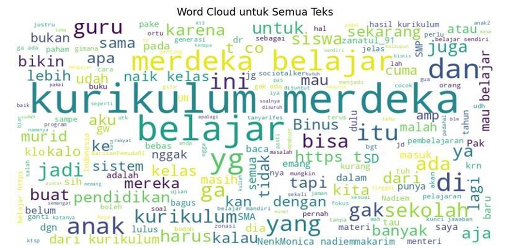

# Sentiment-Analysis
Sentiment analysis on the Merdeka Belajar curriculum using NLP techniques and Support Vector Machine (SVM).

## 📌 Fitur Utama
- Crawling data Twitter dengan `tweet-harvest`
- Preprocessing teks: case folding, cleaning, normalisasi, tokenisasi, stopword removal, lemmatization
- Visualisasi: WordCloud, distribusi teks, frekuensi kata
- Pembobotan teks dengan **TF-IDF**
- Labeling sentimen: Positif, Negatif, Netral
- Klasifikasi dengan **SVM**
- Evaluasi: akurasi, precision, recall, f1-score, confusion matrix

## ⚙️ Tools
- **Python** (Google Colab / Jupyter Notebook)  
- **Library**: pandas, numpy, matplotlib, seaborn, wordcloud, scikit-learn, nltk, regex, imbalanced-learn

## 📂 Struktur File
- `Sentiment_Analysis.ipynb` → Notebook utama (Google Colab).
- `Sentiment_Analysis.py` → Versi script Python.
- `Data.xlsx` → Dataset hasil crawling (contoh).
- `requirements.txt` → Dependensi project.

## 🚀 Cara Menjalankan
1. Clone repository ini:
   ```bash
   git clone https://github.com/nabilandf/Sentiment-Analysis.git
   cd Sentiment-Analysis

Install dependensi:
```bash
pip install -r requirements.txt
```

Jalankan notebook:
```bash
jupyter notebook Sentiment_Analysis.ipynb
```
- ### 🔤 Visualisasi Wordcloud
Berikut **Wordcloud** yang dihasilkan dari data teks:



## 📊 Hasil Analisis
Model awal menghasilkan akurasi sekitar **91%**, namun dengan kelemahan:
- Model cenderung bias pada kelas **Netral** (karena data tidak seimbang).
- Kelas **Negatif** dan **Positif** tidak terdeteksi dengan baik.

⚠️ Hal ini menunjukkan adanya **class imbalance problem**, sehingga diperlukan:
- Oversampling / undersampling (contoh: **SMOTE**),
- Penggunaan `class_weight='balanced'`,
- Atau algoritma lain seperti Random Forest / XGBoost.
