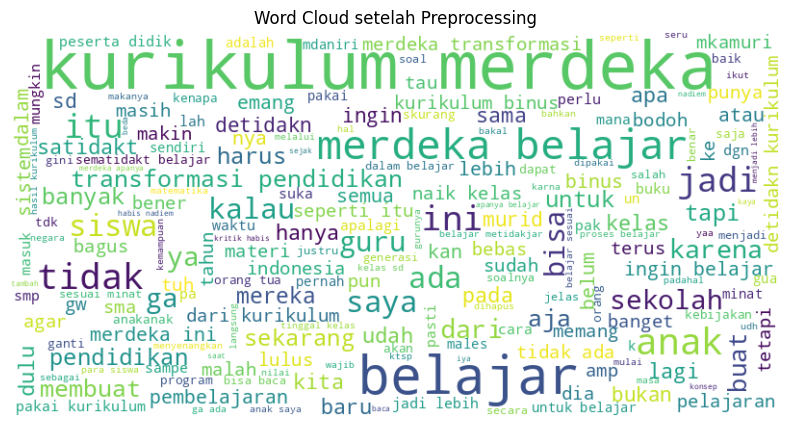

# Sentiment-Analysis
Sentiment analysis on the Merdeka Belajar curriculum using NLP techniques and Support Vector Machine (SVM).

## 📌 Fitur Utama
- Crawling data dari Twitter menggunakan `tweet-harvest`.
- Preprocessing teks:
  - Case Folding
  - Cleaning (hapus angka, URL, simbol, dll.)
  - Normalisasi kata tidak baku
  - Tokenisasi
  - Stopword Removal
  - Lemmatization
- Visualisasi (WordCloud, distribusi panjang teks, frekuensi kata).
- Pembobotan teks dengan **TF-IDF**.
- Labeling sentimen (Positif, Negatif, Netral).
- Klasifikasi menggunakan **Support Vector Machine (SVM)**.
- Evaluasi performa model (akurasi, precision, recall, f1-score, confusion matrix).

## ⚙️ Teknologi yang Digunakan
- **Python** (Google Colab / Jupyter Notebook)
- **Library utama**:
  - pandas, numpy → pengolahan data
  - matplotlib, seaborn, wordcloud → visualisasi
  - scikit-learn → preprocessing & machine learning
  - nltk, regex → text preprocessing
  - imbalanced-learn → penanganan data tidak seimbang
  - 
## 📂 Struktur File
- `Sentiment_Analysis.ipynb` → Notebook utama (Google Colab).
- `Sentiment_Analysis.py` → Versi script Python.
- `Data.xlsx` → Dataset hasil crawling (contoh).
- `requirements.txt` → Dependensi project.

- ### 🔤 Visualisasi Wordcloud
Berikut contoh **Wordcloud** yang dihasilkan dari data teks:



## 🚀 Cara Menjalankan
1. Clone repository ini:
   ```bash
   git clone https://github.com/nabilandf/Sentiment-Analysis.git
   cd Sentiment-Analysis

pip install -r requirements.txt

Jalankan notebook di Jupyter/Colab:
jupyter notebook Sentiment_Analysis.ipynb


📊 Hasil Singkat
## 📊 Hasil Analisis
Model awal menghasilkan akurasi sekitar **91%**, namun dengan kelemahan:
- Model cenderung bias pada kelas **Netral** (karena data tidak seimbang).
- Kelas **Negatif** dan **Positif** tidak terdeteksi dengan baik.

⚠️ Hal ini menunjukkan adanya **class imbalance problem**, sehingga diperlukan:
- Oversampling / undersampling (contoh: **SMOTE**),
- Penggunaan `class_weight='balanced'`,
- Atau algoritma lain seperti Random Forest / XGBoost.
